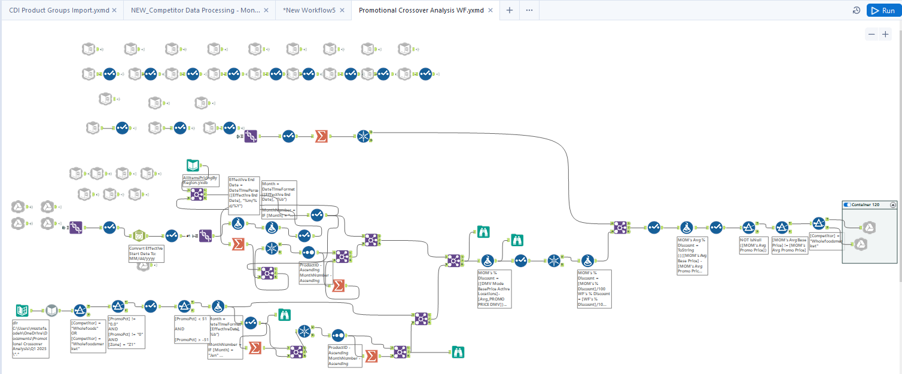

# Promotional Depth Competitive Analysis

This project analyzes promotional pricing depth relative to Whole Foods Market to identify competitive gaps and opportunities to improve promotional strategy. Using an Alteryx workflow integrating 24+ data sources, the analysis compares 12 months of promotional activity and quantifies differences in discount depth.

---

## Overview

This project analyzes promotional pricing depth in comparison to a key competitor, Whole Foods Market. The goal of the analysis was to determine whether our promotional discounts were competitive in the market and to identify opportunities to improve promotional strategy.

By combining multiple internal and external data sources and analyzing a full year of promotional history, this project quantifies promotional depth differences and highlights areas where deeper promotions could improve competitiveness.

---

## Problem Statement

Promotions are a critical driver of retail sales and customer acquisition. However, without a clear understanding of competitor promotional behavior, it can be difficult to determine whether promotions are sufficiently competitive.

The objective of this project was to:

- Compare promotional depth against Whole Foods
- Identify gaps in promotional discounting
- Provide actionable insights to inform future promotional strategy

---

## Data Sources

The analysis was built using data aggregated from **24+ internal and external sources**, including:

- Historical promotional pricing data
- Competitor promotional pricing data
- Product-level promotional records
- Category-level promotional performance metrics

The data covered **12 months of promotional history**.

---

## Tools & Technologies

- **Alteryx** – Data ingestion, transformation, and workflow automation  
- **Google Sheets** – Data organization and visualization of insights  
- **Spreadsheet-based analysis** – Promotional depth calculations and comparisons

---

## Methodology

### 1. Data Integration

A complex **Alteryx workflow** was developed to pull in data from over two dozen sources and consolidate promotional history into a single dataset.

### 2. Data Cleaning & Transformation

The raw data required extensive cleaning and standardization to ensure promotional records were comparable across both retailers. This included:

- Standardizing product identifiers  
- Aligning promotional timeframes  
- Normalizing pricing and discount calculations

### 3. Promotional Depth Calculation

Promotional depth was calculated using discount percentages derived from regular price vs promotional price. These calculations allowed for direct comparison between retailers.

### 4. Data Visualization

The final dataset was exported into **Google Sheets**, where the data was organized and color-coded to highlight promotional differences across categories and products.

---

## Key Findings

The analysis revealed that Whole Foods Market ran promotions that were **approximately 2% deeper on average** compared to ours over the 12-month period.

[View Promotional Crossover Analysis Sheet](Promotional Crossover Analysis WF Sheet.pdf)

---

## Business Impact

The results of this analysis were presented to senior leadership during a State of the Department meeting.

Following the presentation:

- Insights were shared with the **Category Management team**
- The analysis supported **vendor negotiations**
- Efforts were made to secure **deeper promotional pricing** to improve competitiveness

---

## Key Skills Demonstrated

- Data pipeline development  
- Competitive pricing analysis  
- Data cleaning and transformation  
- Retail promotional analytics  
- Stakeholder presentation and business communication
